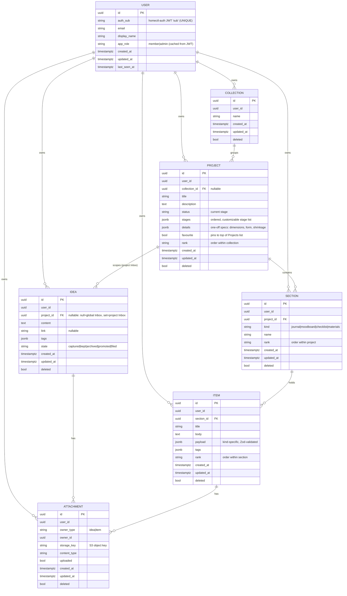
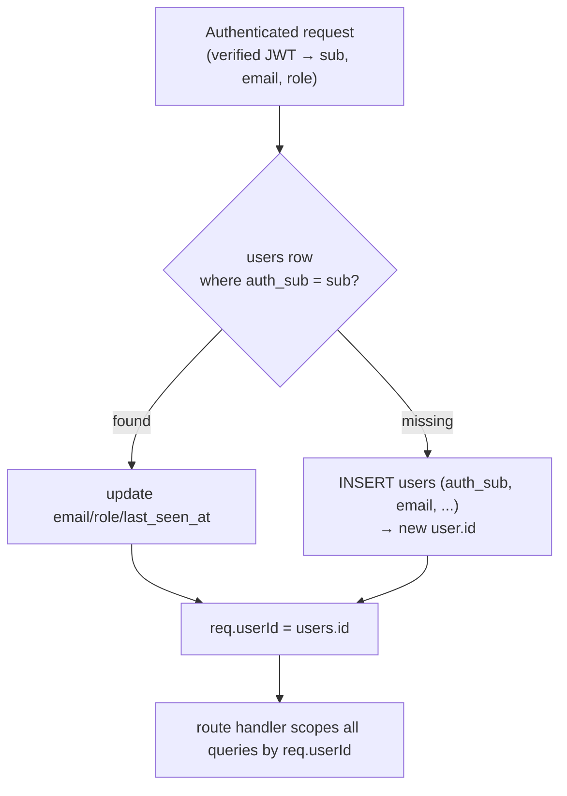
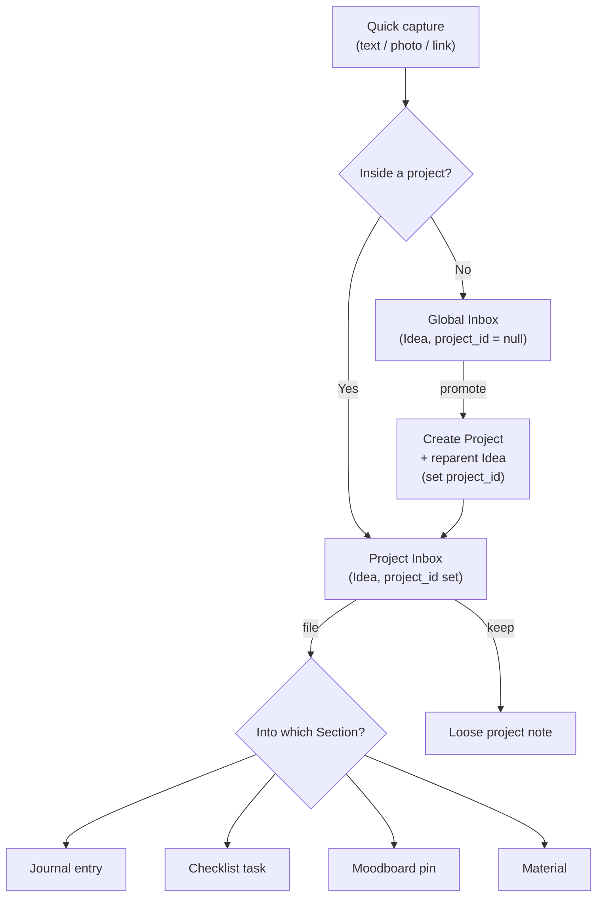
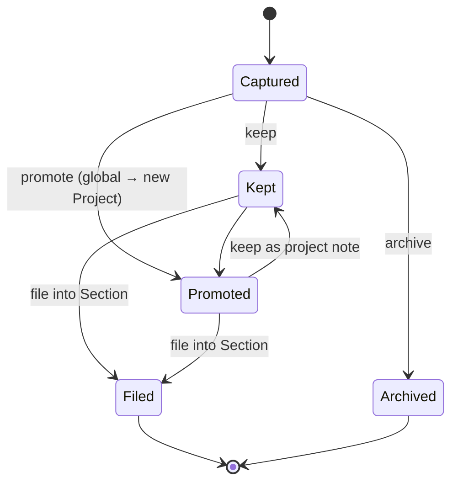

# Workbench — Domain Model

> **Status:** Approved — ready for implementation · **Date:** 2026-06-03 · **Author:** Ann-Katrin Gagnat
> Companion to [`workbench-prd.md`](./workbench-prd.md) §6, [`ui-ux-design.md`](./ui-ux-design.md) (how these entities are presented), and [`visual-identity.md`](./visual-identity.md). This document describes the entities, relationships, and core flows of the Workbench domain using diagrams. It is the canonical reference for the data model.

## Core idea

Five conceptual groups:

0. **User** — the app's own identity record (owns every other row via `user_id`); maps to the auth provider through a single `auth_sub` column.
1. **Collection → Project** — organisation of committed work.
2. **Section → Item** — a *single* container pattern (`kind` discriminator) that unifies journal, moodboard, checklist, and materials. The thing people thought were four different features are one shape: *a named container of small records*.
3. **Idea** — the universal **capture primitive**, living in the global Inbox or a project-scoped Inbox, later *processed* (promoted or filed).
4. **Attachment** — photos, with a polymorphic owner (Idea or Item).

---

## Entity-relationship diagram

**Notes**
- Every content row carries `user_id` → **`users.id`** (the app's own identity, **not** the auth `sub`). The auth `sub` is stored once, on the `USER` row (`auth_sub`). Content rows also carry `created_at` / `updated_at` / `deleted` (soft-delete tombstone) for **last-write-wins sync**.

> **Why `user_id` is on *every* content row (deliberate denormalization).** Ownership *is* derivable through the parent chain (`item → section → project → user_id`), and in a normal online-only CRUD app you would derive it rather than store it. We denormalize the owner key onto **all six** content tables on purpose, because the **local-first sync** design depends on it:
> 1. **Flat, indexed pulls** — incremental sync is `WHERE user_id = $me AND updated_at > $cursor` on the `(user_id, updated_at)` index, one cheap scan per table. Deriving ownership would turn every pull into a multi-join and defeat the index.
> 2. **Polymorphic attachments** — an `attachment`'s owner is an Idea *or* an Item; a direct `user_id` avoids a conditional join on every sync.
> 3. **Out-of-order replication** — a child can reach the server (or a second device) before its parent, or while the parent is a delete-tombstone. A self-describing `user_id` keeps every row authorizable/partitionable regardless of arrival order; parent-derived ownership leaves such rows transiently unscopeable.
> 4. **Cheap push authorization** — the server confirms ownership per incoming row with a single field check, with no need to walk (possibly not-yet-persisted) parent chains.
> 5. **Partition key** — like every sync engine (PowerSync, Electric, RxDB, Firebase rules), the uniform per-row owner key is what keeps both the server engine and the Dexie client queries simple.
>
> **No integrity risk:** the server **re-asserts `user_id` from the authenticated token on every write** (never trusts the client), and data is **private-per-person** with no cross-user moves — so a child's `user_id` can never legitimately diverge from its parent's. The redundancy is guaranteed-consistent at a cost of 16 bytes/row. **Do not "normalize this away."**
- `USER` is **server-side identity**, not a synced content table — the current user is fetched via `/api/me` (see below); other users' rows are never sent to a client.
- `ATTACHMENT` has a **polymorphic owner** (`owner_type` + `owner_id`) — there is no DB foreign key for it; ownership is enforced in application code.
- A **global Idea** has `project_id = null`; a **project-scoped Idea** sets `project_id`. The two ER edges to `IDEA` are the same column at different values.

---

## Identity & provisioning

Workbench keeps its **own** identity rather than scoping data directly by the auth provider's `sub`:

- All authentication is delegated to **homectl-auth** (OAuth2 + RS256 JWT). The token's `sub` identifies the person *to the auth service*.
- The app maps that `sub` to its **own** `users.id` and uses *that* as `user_id` everywhere. Decoupling means the auth service can be re-keyed or replaced without rewriting ownership across all data.

**Provisioning (just-in-time on first login):**

A `resolveUser` middleware runs right after the auth middleware. The client learns its own `user.id` from **`GET /api/me`** and stamps it on locally-created rows; on `push`, the server re-asserts `user_id` from the resolved identity as a safety net (never trusts the client-supplied value).

---

## Section kinds and Item payloads

A Section's `kind` determines how its Items are rendered and which `payload` schema (a Zod discriminated union) validates them on write.

| Section `kind` | Item represents | `payload` fields (beyond shared title/body) |
|----------------|-----------------|---------------------------------------------|
| `journal`      | a timestamped **entry** | `entry_at` |
| `checklist`    | a **task** | `done` |
| `moodboard`    | a **pin** | `subtype` (`image` \| `link`), `url` (for links), caption (uses `body`); image lives as an Attachment |
| `materials`    | a **material** | `quantity`, `unit` (notes use `body`) |

A Project can have **multiple named Sections of any kind** (e.g. journals "Variant A" and "Variant B"). Adding a new `kind` is a schema no-op but still needs its own UI + validation.

---

## Capture & processing flow

Capture is always type-free — you dump an Idea and add structure later.

Both **promote** (global → project) and **file** (idea → Section Item) are ways of *processing* the same Idea entity — no bespoke conversion type.

---

## Idea lifecycle

- **Promoted** ideas become project-scoped (gain a `project_id`) and then behave like any project Idea.
- **Filing** an Idea creates the corresponding Section Item (carrying its content + attachments) and marks the Idea `filed`.
- **"Keep as note"** (in a project Inbox) is just `state = kept` on a project-scoped Idea — a loose project note. It surfaces in that project Inbox's **Kept** segment ([`ui-ux-design.md`](./ui-ux-design.md) §4), exactly mirroring the global Inbox's New/Kept split. There is no separate `note` state — `kept` covers both global and project-scoped retained ideas.

---

## Cross-cutting concerns

- **Tags** — free-form labels stored as a JSONB array on Ideas, Projects, and Items. Entered as autocomplete chips; filtering is local per list ([`ui-ux-design.md`](./ui-ux-design.md) §9.2). No global cross-entity tag browser in V1.
- **Favourites** — `project.favourite` pins a project to the top of the Projects list ([`ui-ux-design.md`](./ui-ux-design.md) §5). V1 favourites apply to Projects only.
- **Ordering** — Projects within a Collection, Sections within a Project, and Items within a Section each carry a `rank`. Ranks are **fractional / lexicographic** (insert-between without renumbering) so concurrent offline reorders under LWW sync don't collide. The reorder gesture (long-press drag) is specified in [`ui-ux-design.md`](./ui-ux-design.md) §8.
- **Sync** — six **content** tables sync (`collection`, `project`, `section`, `item`, `idea`, `attachment`), each pulled/pushed by `updated_at` with tombstones; the uniform shape keeps the local-first sync engine simple. The `users` table is server-side identity and does **not** sync (the current user comes from `/api/me`).
- **Per-kind integrity** — enforced in application code (Zod), not the database, since `section`/`item` are generic tables.
